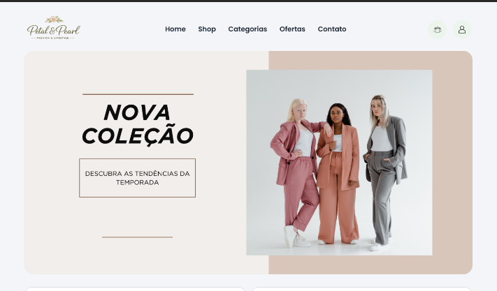

# 🌸 Petal & Pearl

Um projeto de e-commerce moderno desenvolvido com HTML5 e CSS3, focado em uma experiência elegante para o segmento de moda e lifestyle.

## 📖 Sobre o Projeto

O Petal & Pearl é uma landing page de e-commerce criada para praticar conceitos de desenvolvimento front-end, responsividade e design moderno.

O projeto apresenta uma interface limpa e sofisticada, inspirada em lojas online de moda, com seções estratégicas para apresentação de produtos, categorias, promoções e depoimentos de clientes.

---

## ✨ Funcionalidades

- Header com navegação principal
- Banner principal (Hero Section)
- Benefícios da loja
- Categorias de produtos
- Produtos em destaque
- Banner promocional
- Depoimentos de clientes
- Footer completo
- Layout responsivo para:
  - Desktop
  - Tablet
  - Mobile
- Menu hambúrguer para dispositivos móveis

---

## 🛠️ Tecnologias Utilizadas

- HTML5
- CSS3
- Flexbox
- Media Queries
- Google Fonts

---

## 📱 Responsividade

O projeto foi desenvolvido utilizando a abordagem Mobile First adaptada para diferentes tamanhos de tela.

### Desktop
- Layout completo
- Navegação horizontal
- Grid de produtos em linha

### Tablet
- Banner otimizado
- Ajustes de espaçamento
- Menu hambúrguer

### Mobile
- Layout em coluna
- Cards empilhados
- Footer adaptado
- Menu lateral responsivo

---

## 📂 Estrutura do Projeto

```bash
Petal-Pearl/
│
├── assets/
│   ├── benefits/
│   ├── categorias/
│   ├── best-seller/
│   ├── testimonial/
│   ├── rede-social/
│   ├── logo.png
│   ├── banner-desktop.png
│   ├── banner-tablet.png
│   └── banner-mobile.png
│
├── css/
│   └── style.css
│
├── index.html
│
└── readme.md
```

---

## 🎨 Design

A identidade visual do projeto foi construída utilizando tons suaves e elegantes:

| Cor | Uso |
|------|------|
| #63af62 | Botões e destaques |
| #EEF0E5 | Fundos suaves |
| #F7F7F5 | Fundo principal |
| #333333 | Textos principais |

---

## 🚀 Como Executar

1. Clone o repositório:

```bash
git clone https://github.com/seu-usuario/petal-pearl.git
```

2. Acesse a pasta do projeto:

```bash
cd petal-pearl
```

3. Abra o arquivo:

```bash
index.html
```

ou utilize a extensão Live Server do VS Code.

---

## 📸 Preview

Adicione aqui uma captura de tela do projeto:

```md

```

---

## 📚 Aprendizados

Durante o desenvolvimento deste projeto foram praticados conceitos como:

- Estruturação semântica com HTML
- Flexbox
- Responsividade com Media Queries
- Organização de componentes visuais
- Boas práticas de CSS
- Construção de layouts modernos

---

## 👩‍💻 Desenvolvedora

**Geana**

Desenvolvedora Back-end com foco em Node.js, TypeScript e NestJS, expandindo conhecimentos em desenvolvimento Front-end e interfaces responsivas.

### Contato

- LinkedIn: https://www.linkedin.com/in/geana-almeida/
- GitHub: https://github.com/Geana-Almeida

---

⭐ Projeto desenvolvido para fins de estudo e aprimoramento das habilidades em desenvolvimento web.
